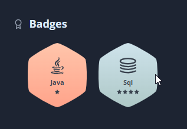

### About me
Testing, detecting bugs and their causes, has been a passion of mine for a long time. In order to develop these abilities, I decided to take an intensive "Software Tester" course. According to the results of the Thomas PPA test, I am a thorough person who pays a lot of attention to detail, which makes me excel in my new role.

### Courses and Certificates
- Tester Oprogramowania [SDAcademy](#)
- Podstawy manualnego testowania oprogramowania [Udemy](https://www.udemy.com/certificate/UC-11c0ad61-586b-43ce-9c06-9803c32dedaa/)
- Praktyczny kurs testowania oprogramowania [Udemy](https://www.udemy.com/certificate/UC-169c5f4c-697b-499b-acd5-2ec51f5c6f07/)
- Postman od podstaw - testowanie REST API [Udemy](https://www.udemy.com/certificate/UC-bcbf85f3-92da-4c40-9630-09c801ba4706/)
- Kurs SQL od podstaw | MySQL [Udemy](https://www.udemy.com/certificate/UC-ffc05560-fc06-4db3-984a-93ce32a03421/)
- MySQL tworzenie i zarządzanie bazami danych [Udemy](https://www.udemy.com/certificate/UC-5a2be6bc-6567-4019-aea6-bc9656fe0902/)
- Kurs Jira od podstaw - zarządzanie projektami [Udemy](https://www.udemy.com/certificate/UC-e82733a4-b25f-4910-a346-7389d10ed379/)

### Skills
- Creating test cases
- Bug reporting
- Theoretical knowledge from the ISTQB
- Agile methodologies, Scram
- SQL / MySQL database basics
- API testing
- Java basics
- Git
- DevTools
- Basics of performance testing
- HTML, CSS, JavaScript

### Trophy
- [HackerRank Profile](https://www.hackerrank.com/adicegielka) 
  
- [Codewars Profile](https://www.codewars.com/users/AdamCegielka) 
 

### Books
- Certyfikowany Tester ISTQB Poziom Podstawowy - Adam Roman i Lucjan Stapp
- Zawód Tester - Radosław Smilgin
- Ścieżka Testera - Rafał Podraza
- Testowanie Oprogramowania - Rafał Pawlak
